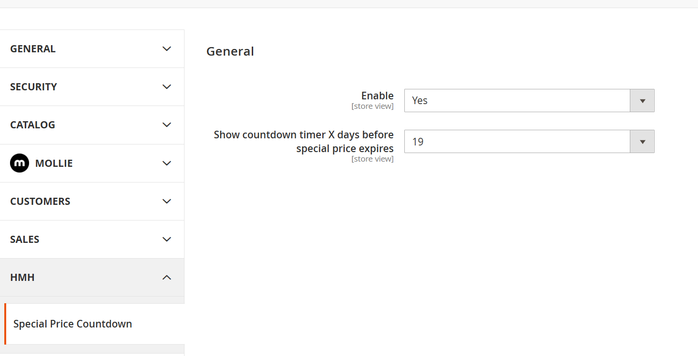
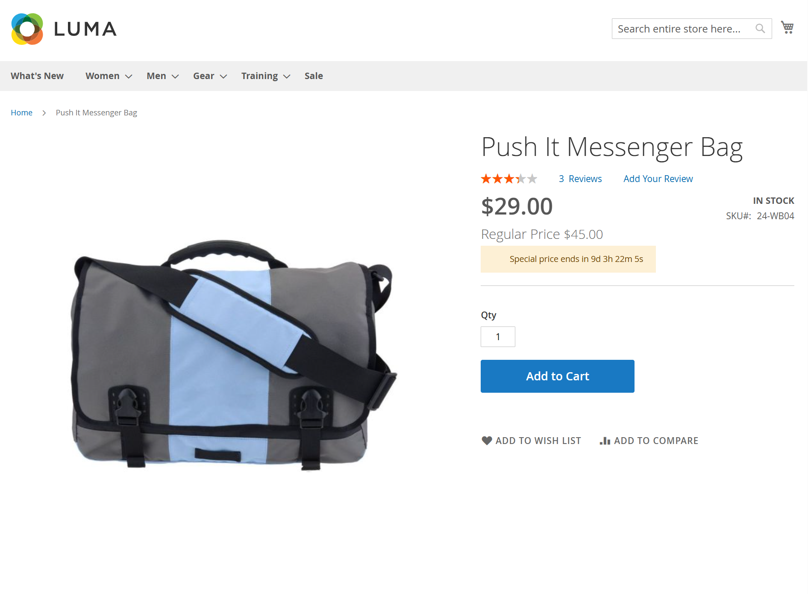

# Hmh SpCountDown

Frontend price-box mixin that shows a countdown message when a product has a `special_to_date`. Works with configurable products by resolving the selected child’s special price end date and respects the module’s admin settings.

## Features
- Adds a notice under the price showing time remaining until `special_to_date`.
- Supports configurable products via swatch selections and `selected_configurable_option`.
- Respects admin settings for enabling and limiting the countdown window.
- Cleans up when the countdown ends or the price box reloads.

## Installation
- Enable the module: `bin/magento module:enable Hmh_SpCountDown`
- Run setup upgrade/DI compile as needed (or `make deploy` in this repo).

## Configuration (Stores > Configuration > HMH > Special Price Countdown)
- Enable: master toggle for the countdown.
- Show countdown timer X days before special price expires: limit when the countdown appears (uses `Hmh\SpCountDown\Model\Config\Source\CountdownDays` options).

## Usage
Once enabled, the countdown appears automatically when a product (or selected child of a configurable) has a valid `special_to_date` within the configured window.

## Customization
- Message template: edit `src/app/code/Hmh/SpCountDown/view/frontend/web/template/special-price-message.html` to change markup, classes, or inline styles.
- Translations: update or add CSVs under `src/app/code/Hmh/SpCountDown/i18n/` (e.g. `en_US.csv`, `en_GB.csv`) for the JS strings.

## Screenshots
### Admin Configuration

### Simple Product Countdown

### Configurable Product Countdown

